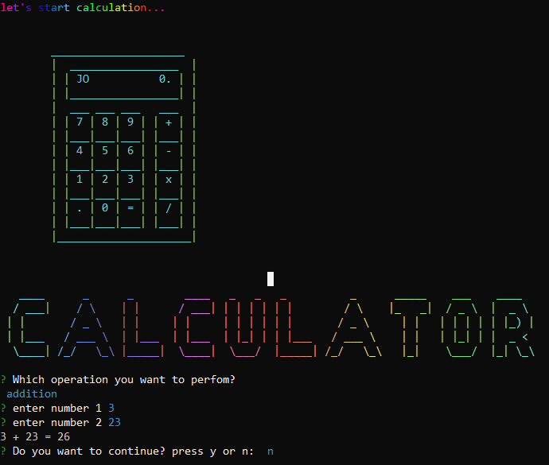

# Simple Command Line Calculator
## I have developed a simple command line calculator using TypeScript, Node.js, and Inquirer.

## clone this project in your machine using cmd.

## step-1
## open the terminal and go to the project path and run.
## npm i calc-by-hamza
## after executing npm i calc-by-hamza if you want to experience our cli base calculator you use npx calc-by-hamza and press enter.

## after executing npx calc-by-hamza you see this screen in cmd.

